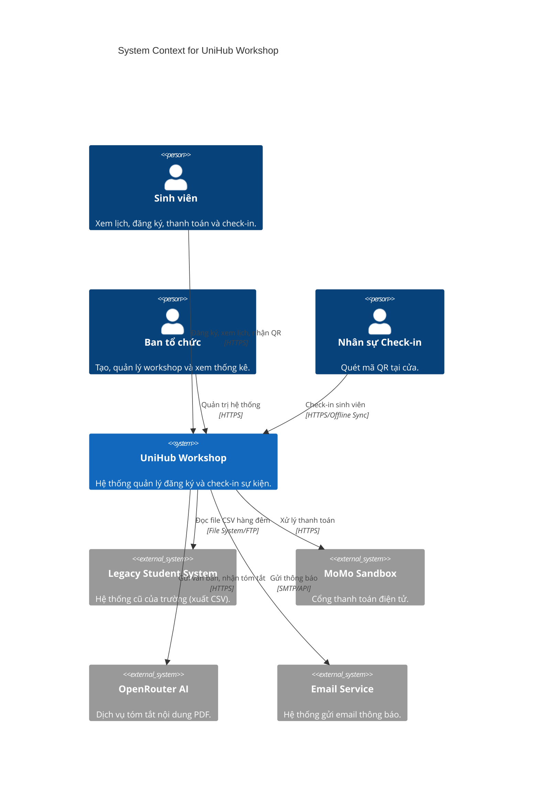
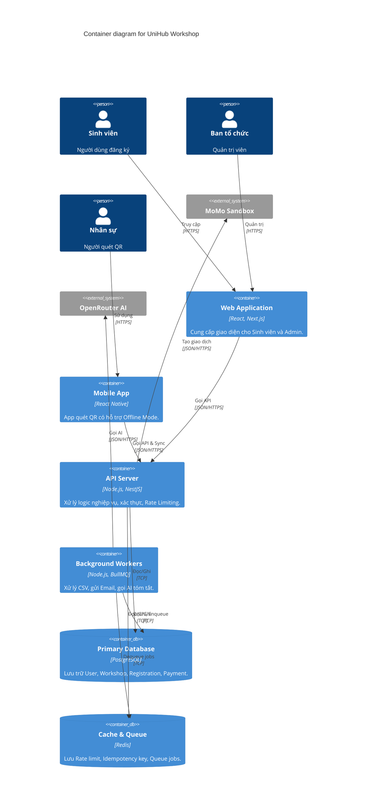
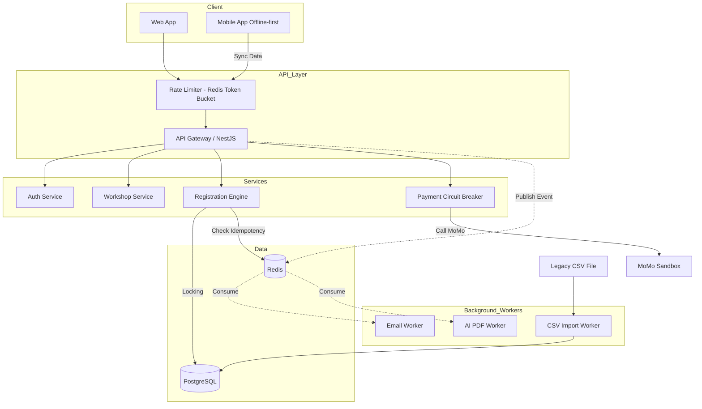

# UniHub Workshop — Technical Design

## Kiến trúc tổng thể
Hệ thống sử dụng kiến trúc **Modular Monolith** kết hợp với các **Background Workers**.
- **Lý do lựa chọn:** Giúp giảm độ phức tạp của việc triển khai (deploy) so với Microservices nhưng vẫn giữ được sự độc lập giữa các module (Auth, Workshop, Registration, Payment). Khi dự án lớn hơn, có thể dễ dàng tách các module thành Microservices.
- **Thành phần chính:**
  - **Client:** Web App (React/Next.js) cho Sinh viên/Admin, Mobile App (React Native/Flutter) cho Check-in.
  - **API Gateway / Backend Server:** Node.js (NestJS) cung cấp RESTful APIs.
  - **Database:** PostgreSQL cho dữ liệu chính, Redis cho caching, rate limiting, pub/sub.
  - **Message Queue:** BullMQ (dựa trên Redis) xử lý tác vụ nền.
  - **External Integrations:** OpenRouter (AI), MoMo Sandbox (Payment).

## C4 Diagram

### Level 1 — System Context

### Level 2 — Container

## High-Level Architecture Diagram
Sơ đồ kiến trúc chú trọng vào luồng thanh toán và check-in offline.

## Thiết kế cơ sở dữ liệu
- **Loại Database:** Relational (PostgreSQL).
- **Lý do:** Hệ thống yêu cầu tính toàn vẹn dữ liệu cao (ACID) đối với giao dịch thanh toán và đặc biệt là việc đăng ký slot (sử dụng row-level locking). 

**Schema cơ bản (ERD):**
- `Users`: id, email, role (student, admin, staff), ...
- `Workshops`: id, title, description, ai_summary, capacity, location, price, start_time, ...
- `Registrations`: id, user_id, workshop_id, status (pending, paid, cancelled, checked_in), qr_code, ...
- `Payments`: id, registration_id, amount, status, idempotency_key, gateway_transaction_id.

## Thiết kế kiểm soát truy cập
- **Mô hình:** RBAC (Role-Based Access Control) kết hợp với JWT Token.
- **Quyền hạn:**
  - `Student`: Read Workshops, Create Registration, Read own Registration/Payment.
  - `Admin`: Full CRUD Workshops, Read all Registrations.
  - `Staff`: Update Registration status (Check-in).
- **Kiểm tra quyền:** Middleware `RolesGuard` ở tầng API Gateway sẽ decode JWT, lấy thuộc tính `role` và so sánh với metadata yêu cầu của endpoint.

## Thiết kế các cơ chế bảo vệ hệ thống

### 1. Kiểm soát tải đột biến

#### Giải pháp: 

Sử dụng thuật toán Token Bucket cho Rate limiting. Sử dụng 2 token bucket, 1
bucket để giới hạn tổng lượng request tới api đăng ký workshop trong cùng 1 thời điểm, 1
bucket để giới hạn số lượng request mỗi user có thể gửi tại 1 thời điểm.

#### Cách hoạt động:
- Tạo bucket trên Redis chứa token cho các request, mỗi request sẽ tốn 1 token.
    Lượng token sẽ được nạp lại đều đặn theo thời gian dựa trên tốc độ refill được định
    nghĩa trước.
- Bucket giới hạn tổng lượng request sẽ có rate limit key global, bucket của user sẽ có
    rate limit key theo user id.
- Bucket global giới hạn 2400 token, tốc độ nạp là 20 token/s. Bucket của user giới
    hạn 10 token, tốc độ nạp là 1 token/s.
- Khi nhận request sẽ kiểm tra rate limit key theo user trước. Nếu chưa vượt ngưỡng
    thì tiếp tục kiểm tra với rate limit key global. Nếu vẫn nằm trong giới hạn thì request
    sẽ được xử lý. Nếu một trong hai bucket hết token thì request sẽ bị chặn và trả về
    http status 429 (too many request).

#### Lý do lựa chọn: 

Việc sử dụng thuật toán Token bucket phù hợp với tình huống burst ngắn
của bài toán, với lượng truy cập lớn ở thời điểm đầu khi mở đăng ký workshop. Sử dụng cả
bucket global và bucket cho từng user vừa đảm bảo backend không bị quá tải, vừa đảm bảo
tính công bằng trong việc đăng ký.

### 2. Xử lý cổng thanh toán không ổn định

#### Giải pháp: 

Sử dụng Circuit breaker cho kết nối tới cổng thanh toán

####  Cách hoạt động:
- Ở trạng thái closed: Circuit breaker sẽ cho phép backend gửi request đến cổng
    thanh toán của bên thứ ba như MoMo để thực hiện giao dịch.
- Ở trạng thái open: Khi thời gian chờ nhiều hơn 3 giây hoặc số lượng request thất bại
    vượt quá mức 50%, circuit breaker chuyển sang trạng thái open, chặn mọi request
    tới cổng thanh toán và trả về lỗi.
- Ở trạng thái half-open: Sau 30 giây timeout, circuit breaker sẽ cho phép một số
    request tới cổng thanh toán. Nếu kết quả trả về thất bại, circuit breaker sẽ giữ trạng
    thái open. Nếu kết quả trả về thành công, circuit breaker sẽ trở về trạng thái closed
    và cho phép kết nối tới cổng thanh toán.
- Graceful degradation: Khi cổng thanh toán không hoạt động thì chỉ chặn đăng ký các
    workshop có phí và hiển thị thông báo đang khắc phục cổng thanh toán. Việc xem
    các workshop cũng như đăng ký các workshop không tính phí diễn ra bình thường.

#### Lý do lựa chọn: 

Sử dụng circuit breaker để ngắt kết nối với cổng thanh toán khi dịch vụ gặp
lỗi, tránh ngăn lỗi lan rộng ra các phần khác và làm sập hệ thống.

### 3. Chống trừ tiền hai lần

#### Giải pháp: 

Client khi gửi request đến api thanh toán sẽ kèm theo idempotency key bên trong
http header

#### Cách hoạt động:
- Cơ chế sinh key: Client sẽ tạo chuỗi UUID và đặt vào http header khi gửi request
    thanh toán.
- Nơi lưu trữ: Key sẽ được lưu vào Redis
- Kiểm tra trùng lặp: Khi request tới backend, kiểm tra idempotency key bên trong
    header. Nếu đã có key này thì sẽ trả về http status 409 (conflict) nếu như đang xử lý
    thanh toán hoặc trả về kết quả (response body) nếu đã thanh toán thành công. Nếu
    key không được lưu thì sẽ tiếp tục xử lý request để lấy kết quả và lưu kết quả này
    với key từ request của client. Khi lưu key mới vào Redis sẽ thêm option NX(chỉ lưu
    nếu key chưa tồn tại) để tránh trường hợp hai request trùng key tới backend cùng
    lúc và key chưa được tạo.
- Thời gian hết hạn: Khi lưu key mới vào Redis sẽ thiết lập TTL là 5 phút cho key đang
    xử lý thanh toán và đặt lại TTL là 24 giờ cho key thanh toán thành công. Key sẽ tự
    động bị xoá khi thời gian hết hạn trôi qua.

#### Lý do lựa chọn: 

Sử dụng Idempotency key giúp backend nhận biết được request trừ tiền bị
trùng, từ đó xử lý trùng lặp và tránh việc trừ tiền hai lần.
