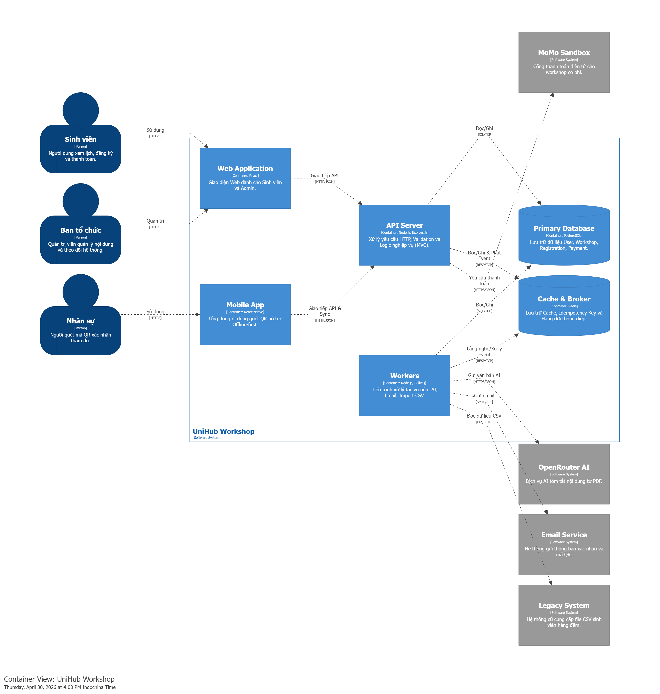
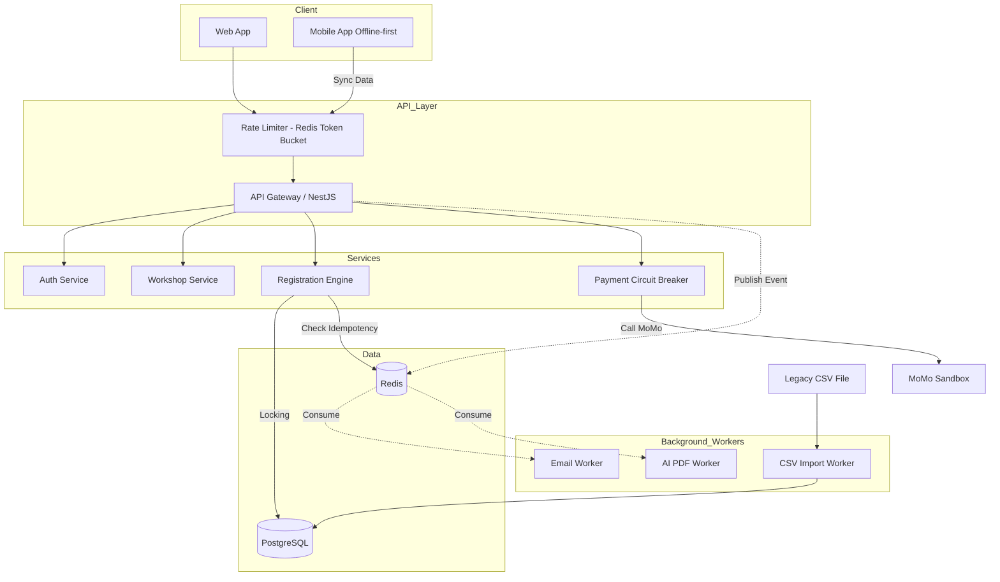

# UniHub Workshop — Technical Design

## Kiến trúc tổng thể

Hệ thống UniHub Workshop được thiết kế theo kiến trúc **Client-Server** kết hợp chặt chẽ với mô hình **Event-Driven**, đồng thời áp dụng pattern **MVC (Model-View-Controller)** mở rộng ở tầng Server.

### 1. Architectural Style & Rationale

**Kiến trúc:** Client-Server giao tiếp qua REST API kết hợp cơ chế xử lý bất đồng bộ (Event-Driven) dựa trên Message Queue.

**Lý do lựa chọn:**
- **Express.js (MVC):** Đóng vai trò là HTTP Server cung cấp RESTful API. Pattern MVC giúp phân tách rõ ràng trách nhiệm giữa việc xử lý Request/Validation (Controller), logic nghiệp vụ (Service Layer) và tương tác với database (Model Layer).
- **Event-Driven Architecture (EDA):** Hệ thống phải đáp ứng với tải trọng lớn (12.000 sinh viên truy cập cùng lúc) và các tác vụ nặng (tóm tắt nội dung PDF bằng AI, gửi thông báo hàng loạt, xử lý thanh toán). Việc xử lý đồng bộ toàn bộ logic trong luồng Request-Response sẽ làm Event Loop (Single-thread của Node.js) bị nghẽn, dẫn đến sập API. Với kiến trúc Event-Driven, các tác vụ nặng được đẩy ra khỏi luồng chính thông qua Message Queue, giúp đảm bảo Server luôn sẵn sàng đón nhận request mới.

### 2. System Components

Hệ thống được tổ chức thành các thành phần chính nhằm đảm bảo tính module hóa, khả năng bảo trì và mở rộng:

- **Client (Frontend/View):**
  - **Web App (React):** Cung cấp giao diện Web cho Sinh viên (xem lịch, đăng ký) và Ban tổ chức (quản trị, thống kê).
  - **Mobile App (React Native):** Ứng dụng di động dành cho Nhân sự check-in, tích hợp khả năng lưu trữ cục bộ (Offline-first).
- **Backend Application (Node.js):**
  - **API Server (Express.js):** 
    - **Controller:** Tiếp nhận các yêu cầu HTTP, thực hiện Data Validation và xác thực người dùng (JWT/Role-based).
    - **Service Layer:** Chứa logic nghiệp vụ cốt lõi và là lớp duy nhất được phép phát (emit) các sự kiện (Events) vào hàng đợi.
    - **Model Layer:** Trực tiếp tương tác với Database thông qua ORM/Query Builder, đảm bảo tính toàn vẹn dữ liệu.
  - **Workers (Consumers):** Các tiến trình Node.js chạy độc lập, chuyên lắng nghe và xử lý các tác vụ nặng (AI Summary, Email, Thanh toán) từ hàng đợi nhằm giải phóng tài nguyên cho API Server.
- **Infrastructure & Storage:**
  - **Primary Database (PostgreSQL):** Lưu trữ dữ liệu quan hệ có cấu trúc như thông tin người dùng, workshop và đăng ký.
  - **Cache & Message Broker (Redis):** 
    - Làm hạ tầng cho **BullMQ** để quản lý hàng đợi sự kiện.
    - Lưu trữ dữ liệu tạm thời cho các cơ chế bảo vệ như Rate Limiting, Idempotency Key và Caching dữ liệu thường xuyên truy cập.

### 3. Giao tiếp & Xử lý đặc thù

Hệ thống UniHub Workshop áp dụng các mô hình giao tiếp và cơ chế xử lý tối ưu để đảm bảo khả năng phục hồi và trải nghiệm người dùng:

**Giao tiếp Đồng bộ (Synchronous) qua REST API:**
- Mọi tương tác trực tiếp từ Client (Web/Mobile) đến API Server đều được thực hiện thông qua giao thức **HTTP (RESTful API)**.
- **Phản hồi nhanh (Optimistic Response):** Với các tác vụ tốn thời gian, API Server ưu tiên thực hiện các bước kiểm tra hợp lệ (Validation/Locking) và trả về phản hồi ngay lập tức cho Client (ví dụ: HTTP 202 Accepted). Điều này giúp giảm độ trễ cảm nhận của người dùng trong điều kiện tải cao.

**Xử lý Bất đồng bộ (Asynchronous) dựa trên Event-Driven:**
- Hệ thống tách biệt luồng xử lý yêu cầu chính với các tác vụ tốn tài nguyên (như gửi Email, xử lý AI, đồng bộ CSV). 
- **Message Queue (BullMQ):** Các Service Layer phát (emit) sự kiện vào hàng đợi. Các Workers độc lập sẽ thực hiện xử lý ở background. Cơ chế này không chỉ giúp tránh nghẽn luồng Request-Response mà còn cung cấp khả năng Retry tự động khi gặp lỗi ngoại vi (ví dụ: API bên thứ ba timeout).

**Đảm bảo tính nhất quán và Chống trùng lặp (Idempotency):**
- Hệ thống áp dụng cơ chế **Idempotency Key** (UUID) cho các yêu cầu thay đổi trạng thái quan trọng. 
- API Server sử dụng bộ nhớ đệm (Redis) hoặc Database để kiểm tra tính duy nhất của yêu cầu trước khi xử lý, đảm bảo rằng ngay cả khi Client thực hiện retry nhiều lần (do mạng lag hoặc lỗi timeout), kết quả cuối cùng vẫn chỉ được ghi nhận một lần duy nhất.

**Chiến lược Offline-First và Đồng bộ dữ liệu:**
- Mobile App được thiết kế để hoạt động ổn định trong điều kiện mạng yếu hoặc mất mạng hoàn toàn bằng cách lưu trữ dữ liệu tại local database.
- **Batch Synchronization:** Khi có mạng trở lại, ứng dụng sẽ thực hiện đồng bộ dữ liệu theo lô (Batch) lên server. Server xử lý các lô dữ liệu này kết hợp với Idempotency Key để đảm bảo tính toàn vẹn và nhất quán của dữ liệu check-in trên toàn hệ thống.

## C4 Diagram

### Level 1 — System Context

### Level 2 — Container

## High-Level Architecture Diagram
Sơ đồ kiến trúc chú trọng vào luồng thanh toán và check-in offline.

## Thiết kế cơ sở dữ liệu
- **Loại Database:** Relational (PostgreSQL).
- **Lý do:** Hệ thống yêu cầu tính toàn vẹn dữ liệu cao (ACID) đối với giao dịch thanh toán và đặc biệt là việc đăng ký slot (sử dụng row-level locking). 

**Schema cơ bản (ERD):**
- `Users`: id, email, role (student, admin, staff), ...
- `Workshops`: id, title, description, ai_summary, capacity, location, price, start_time, ...
- `Registrations`: id, user_id, workshop_id, status (pending, paid, cancelled, checked_in), qr_code, ...
- `Payments`: id, registration_id, amount, status, idempotency_key, gateway_transaction_id.

## Thiết kế kiểm soát truy cập
- **Mô hình:** RBAC (Role-Based Access Control) kết hợp với JWT Token.
- **Quyền hạn:**
  - `Student`: Read Workshops, Create Registration, Read own Registration/Payment.
  - `Admin`: Full CRUD Workshops, Read all Registrations.
  - `Staff`: Update Registration status (Check-in).
- **Kiểm tra quyền:** Middleware `RolesGuard` ở tầng API Gateway sẽ decode JWT, lấy thuộc tính `role` và so sánh với metadata yêu cầu của endpoint.

## Thiết kế các cơ chế bảo vệ hệ thống

### 1. Kiểm soát tải đột biến (Rate Limiting)
- **Giải pháp:** Sử dụng thuật toán **Token Bucket** triển khai trên Redis.
- **Cách hoạt động:** Khi 12.000 sinh viên truy cập, Redis sẽ cấp phát token cho mỗi IP/User. Nếu vượt quá ngưỡng (ví dụ: 10 request/giây/User), API sẽ trả về HTTP 429 (Too Many Requests).
- **Ưu điểm:** Redis xử lý in-memory cực nhanh, không làm nghẽn Node.js process.

### 2. Xử lý cổng thanh toán không ổn định (Circuit Breaker & Graceful Degradation)
- **Giải pháp:** Áp dụng **Circuit Breaker Pattern** cho luồng gọi sang MoMo.
- **Cách hoạt động:**
  - **Closed:** Trạng thái bình thường, request đi qua MoMo.
  - **Open:** Nếu MoMo timeout liên tục (ví dụ 5 lỗi trong 10 giây), Circuit ngắt (Open). Thay vì đợi timeout gây treo hệ thống, API trả về ngay lập tức lỗi `PaymentGatewayUnavailable`.
  - **Half-Open:** Sau 1 khoảng thời gian, cho phép 1 vài request thử nghiệm. Nếu thành công thì đóng lại (Closed).
- **Graceful Degradation:** Khi Circuit Open, sinh viên vẫn xem được lịch và đăng ký workshop miễn phí bình thường. Với workshop có phí, UI hiện thông báo "Cổng thanh toán đang bảo trì, vui lòng quay lại sau".

### 3. Chống trừ tiền hai lần (Idempotency Key)
- **Giải pháp:** Client sinh ra một chuỗi UUID duy nhất (`Idempotency-Key`) cho mỗi phiên đăng ký/thanh toán và gửi kèm trong HTTP Header.
- **Cách hoạt động:**
  - API nhận request, kiểm tra khóa này trong Redis (với TTL = 24h).
  - Nếu chưa có, ghi khóa vào Redis với trạng thái `processing`, tiếp tục xử lý thanh toán và đổi trạng thái thành `success` hoặc `failed`.
  - Nếu đã có và trạng thái là `success`, trả về kết quả thành công ngay lập tức mà không gọi lại MoMo.
  - Nếu đã có và trạng thái `processing`, trả về lỗi `Conflict` (Client đang spam request).

### 4. Giải quyết tranh chấp chỗ ngồi (Concurrency Control)
- **Giải pháp:** Pessimistic Locking với PostgreSQL.
- **Cách hoạt động:** Khi user bấm đăng ký, hệ thống gọi lệnh `SELECT capacity, registered_count FROM Workshops WHERE id = ? FOR UPDATE`. Dòng này sẽ bị khóa tạm thời. Hệ thống kiểm tra `registered_count < capacity`. Nếu thỏa, tạo `Registration` và tăng `registered_count` lên 1, sau đó `COMMIT`. Các request khác cho cùng workshop sẽ phải đợi lock nhả ra.
