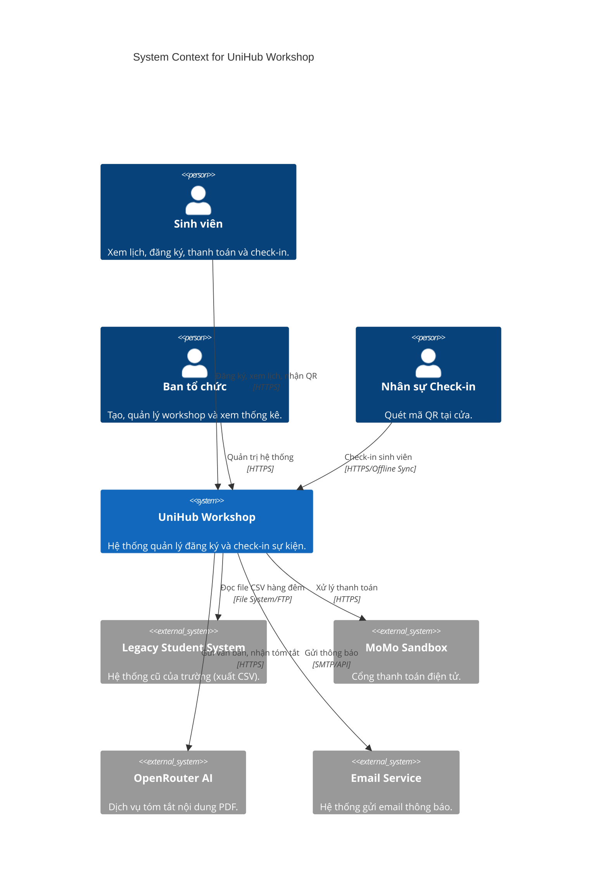
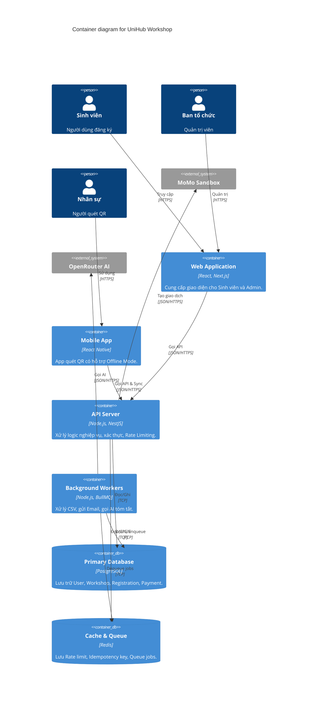
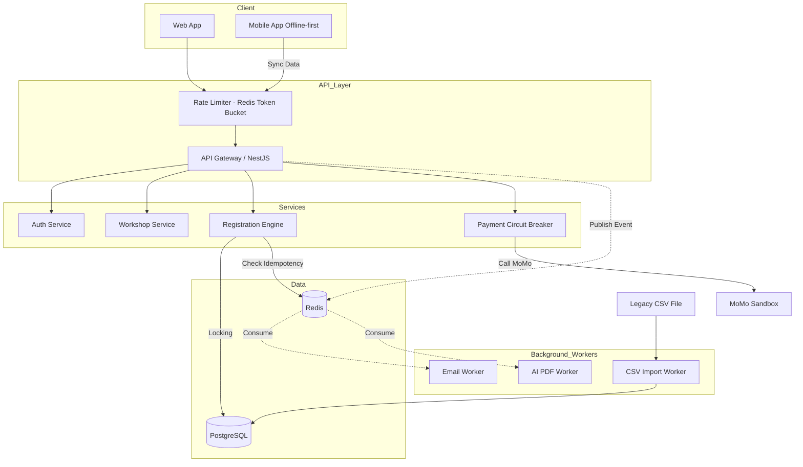

# UniHub Workshop — Technical Design

## Kiến trúc tổng thể
Hệ thống sử dụng kiến trúc **Modular Monolith** kết hợp với các **Background Workers**.
- **Lý do lựa chọn:** Giúp giảm độ phức tạp của việc triển khai (deploy) so với Microservices nhưng vẫn giữ được sự độc lập giữa các module (Auth, Workshop, Registration, Payment). Khi dự án lớn hơn, có thể dễ dàng tách các module thành Microservices.
- **Thành phần chính:**
  - **Client:** Web App (React/Next.js) cho Sinh viên/Admin, Mobile App (React Native/Flutter) cho Check-in.
  - **API Gateway / Backend Server:** Node.js (NestJS) cung cấp RESTful APIs.
  - **Database:** PostgreSQL cho dữ liệu chính, Redis cho caching, rate limiting, pub/sub.
  - **Message Queue:** BullMQ (dựa trên Redis) xử lý tác vụ nền.
  - **External Integrations:** OpenRouter (AI), MoMo Sandbox (Payment).

## C4 Diagram

### Level 1 — System Context

### Level 2 — Container

## High-Level Architecture Diagram
Sơ đồ kiến trúc chú trọng vào luồng thanh toán và check-in offline.

## Thiết kế cơ sở dữ liệu
- **Loại Database:** Relational (PostgreSQL).
- **Lý do:** Hệ thống yêu cầu tính toàn vẹn dữ liệu cao (ACID) đối với giao dịch thanh toán và đặc biệt là việc đăng ký slot (sử dụng row-level locking). 

**Schema cơ bản (ERD):**
- `Users`: id, email, role (student, admin, staff), ...
- `Workshops`: id, title, description, ai_summary, capacity, location, price, start_time, ...
- `Registrations`: id, user_id, workshop_id, status (pending, paid, cancelled, checked_in), qr_code, ...
- `Payments`: id, registration_id, amount, status, idempotency_key, gateway_transaction_id.

## Thiết kế kiểm soát truy cập
- **Mô hình:** RBAC (Role-Based Access Control) kết hợp với JWT Token.
- **Quyền hạn:**
  - `Student`: Read Workshops, Create Registration, Read own Registration/Payment.
  - `Admin`: Full CRUD Workshops, Read all Registrations.
  - `Staff`: Update Registration status (Check-in).
- **Kiểm tra quyền:** Middleware `RolesGuard` ở tầng API Gateway sẽ decode JWT, lấy thuộc tính `role` và so sánh với metadata yêu cầu của endpoint.

## Thiết kế các cơ chế bảo vệ hệ thống

### 1. Kiểm soát tải đột biến (Rate Limiting)
- **Giải pháp:** Sử dụng thuật toán **Token Bucket** triển khai trên Redis.
- **Cách hoạt động:** Khi 12.000 sinh viên truy cập, Redis sẽ cấp phát token cho mỗi IP/User. Nếu vượt quá ngưỡng (ví dụ: 10 request/giây/User), API sẽ trả về HTTP 429 (Too Many Requests).
- **Ưu điểm:** Redis xử lý in-memory cực nhanh, không làm nghẽn Node.js process.

### 2. Xử lý cổng thanh toán không ổn định (Circuit Breaker & Graceful Degradation)
- **Giải pháp:** Áp dụng **Circuit Breaker Pattern** cho luồng gọi sang MoMo.
- **Cách hoạt động:**
  - **Closed:** Trạng thái bình thường, request đi qua MoMo.
  - **Open:** Nếu MoMo timeout liên tục (ví dụ 5 lỗi trong 10 giây), Circuit ngắt (Open). Thay vì đợi timeout gây treo hệ thống, API trả về ngay lập tức lỗi `PaymentGatewayUnavailable`.
  - **Half-Open:** Sau 1 khoảng thời gian, cho phép 1 vài request thử nghiệm. Nếu thành công thì đóng lại (Closed).
- **Graceful Degradation:** Khi Circuit Open, sinh viên vẫn xem được lịch và đăng ký workshop miễn phí bình thường. Với workshop có phí, UI hiện thông báo "Cổng thanh toán đang bảo trì, vui lòng quay lại sau".

### 3. Chống trừ tiền hai lần (Idempotency Key)
- **Giải pháp:** Client sinh ra một chuỗi UUID duy nhất (`Idempotency-Key`) cho mỗi phiên đăng ký/thanh toán và gửi kèm trong HTTP Header.
- **Cách hoạt động:**
  - API nhận request, kiểm tra khóa này trong Redis (với TTL = 24h).
  - Nếu chưa có, ghi khóa vào Redis với trạng thái `processing`, tiếp tục xử lý thanh toán và đổi trạng thái thành `success` hoặc `failed`.
  - Nếu đã có và trạng thái là `success`, trả về kết quả thành công ngay lập tức mà không gọi lại MoMo.
  - Nếu đã có và trạng thái `processing`, trả về lỗi `Conflict` (Client đang spam request).

### 4. Giải quyết tranh chấp chỗ ngồi (Concurrency Control)
- **Giải pháp:** Pessimistic Locking với PostgreSQL.
- **Cách hoạt động:** Khi user bấm đăng ký, hệ thống gọi lệnh `SELECT capacity, registered_count FROM Workshops WHERE id = ? FOR UPDATE`. Dòng này sẽ bị khóa tạm thời. Hệ thống kiểm tra `registered_count < capacity`. Nếu thỏa, tạo `Registration` và tăng `registered_count` lên 1, sau đó `COMMIT`. Các request khác cho cùng workshop sẽ phải đợi lock nhả ra.
