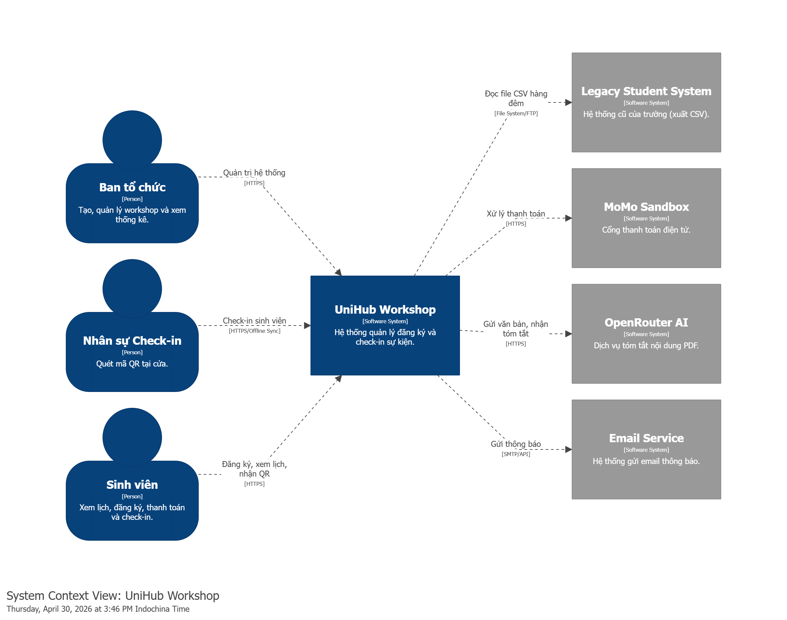
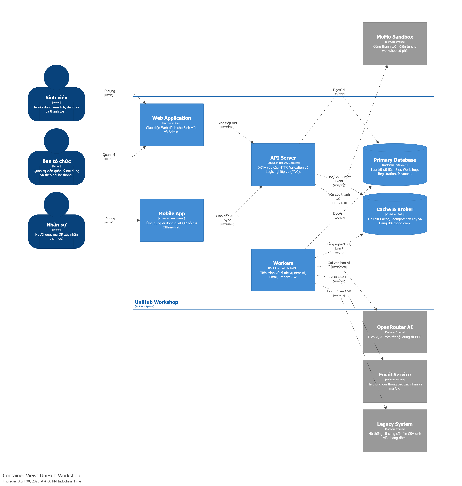
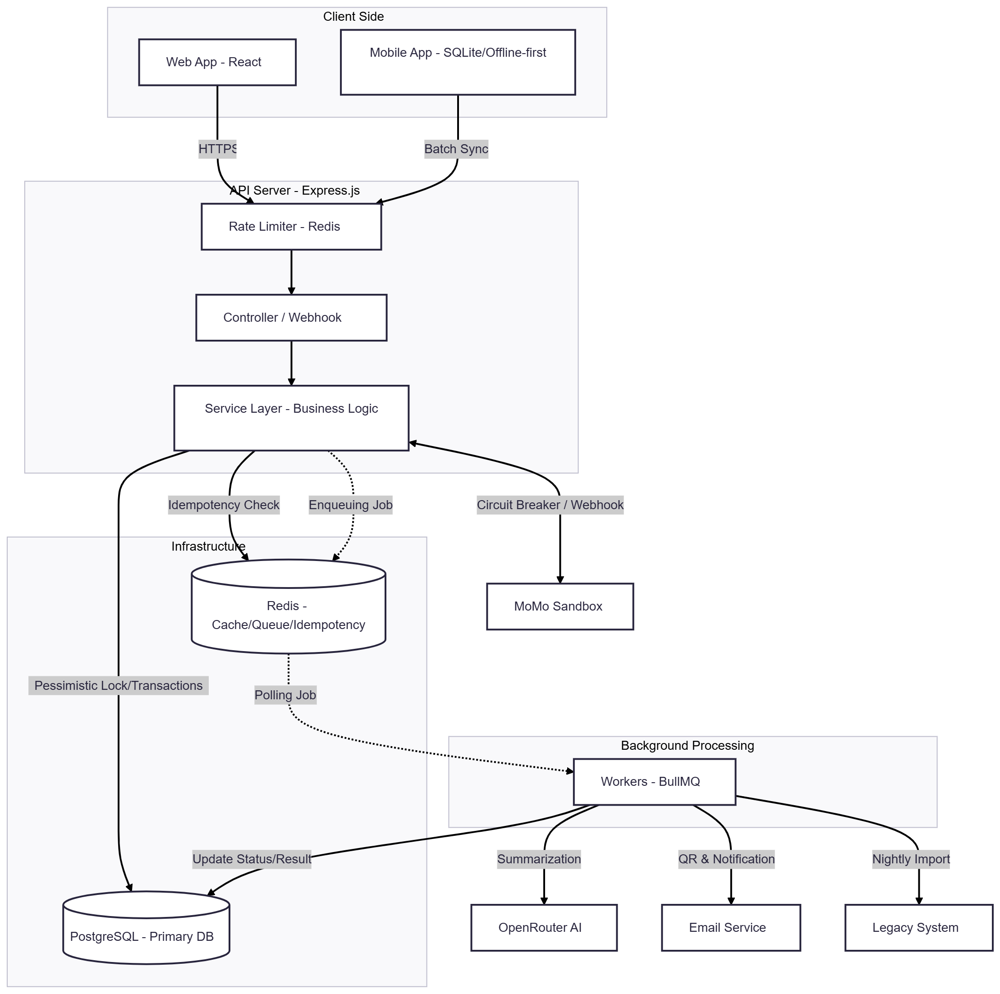
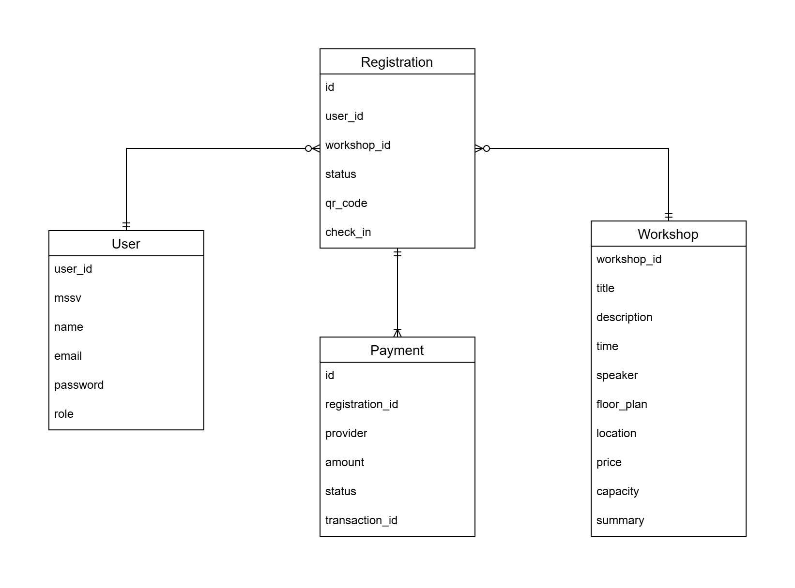
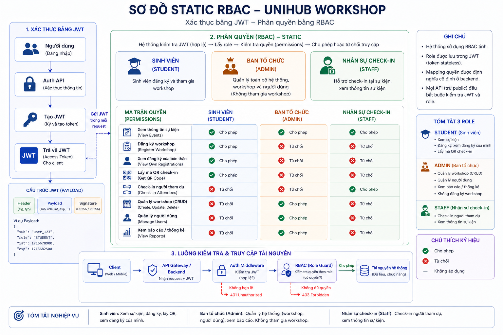

# UniHub Workshop — Technical Design

## Kiến trúc tổng thể

Hệ thống UniHub Workshop được thiết kế theo kiến trúc **Client-Server** kết hợp chặt chẽ với mô hình **Event-Driven**, đồng thời áp dụng pattern **MVC (Model-View-Controller)** mở rộng ở tầng Server.

### 1. Architectural Style & Rationale

**Kiến trúc:** Client-Server giao tiếp qua REST API kết hợp cơ chế xử lý bất đồng bộ (Event-Driven) dựa trên Message Queue.

**Lý do lựa chọn:**
- **Express.js (MVC):** Đóng vai trò là HTTP Server cung cấp RESTful API. Pattern MVC giúp phân tách rõ ràng trách nhiệm giữa việc xử lý Request/Validation (Controller), logic nghiệp vụ (Service Layer) và tương tác với database (Model Layer).
- **Event-Driven Architecture (EDA):** Hệ thống phải đáp ứng với tải trọng lớn (12.000 sinh viên truy cập cùng lúc) và các tác vụ nặng (tóm tắt nội dung PDF bằng AI, gửi thông báo hàng loạt, xử lý thanh toán). Việc xử lý đồng bộ toàn bộ logic trong luồng Request-Response sẽ làm Event Loop (Single-thread của Node.js) bị nghẽn, dẫn đến sập API. Với kiến trúc Event-Driven, các tác vụ nặng được đẩy ra khỏi luồng chính thông qua Message Queue, giúp đảm bảo Server luôn sẵn sàng đón nhận request mới.

### 2. System Components

Hệ thống được tổ chức thành các thành phần chính nhằm đảm bảo tính module hóa, khả năng bảo trì và mở rộng:

- **Client (Frontend/View):**
  - **Web App (React):** Cung cấp giao diện Web cho Sinh viên (xem lịch, đăng ký) và Ban tổ chức (quản trị, thống kê).
  - **Mobile App (React Native):** Ứng dụng di động dành cho Nhân sự check-in, tích hợp khả năng lưu trữ cục bộ (Offline-first).
- **Backend Application (Node.js):**
  - **API Server (Express.js):** 
    - **Controller:** Tiếp nhận các yêu cầu HTTP, thực hiện Data Validation và xác thực người dùng (JWT/Role-based).
    - **Service Layer:** Chứa logic nghiệp vụ cốt lõi và là lớp duy nhất được phép phát (emit) các sự kiện (Events) vào hàng đợi.
    - **Model Layer:** Trực tiếp tương tác với Database thông qua ORM/Query Builder, đảm bảo tính toàn vẹn dữ liệu.
  - **Workers (Consumers):** Các tiến trình Node.js chạy độc lập, chuyên lắng nghe và xử lý các tác vụ nặng (AI Summary, Email, Thanh toán) từ hàng đợi nhằm giải phóng tài nguyên cho API Server.
- **Infrastructure & Storage:**
  - **Primary Database (PostgreSQL):** Lưu trữ dữ liệu quan hệ có cấu trúc như thông tin người dùng, workshop và đăng ký.
  - **Cache & Message Broker (Redis):** 
    - Làm hạ tầng cho **BullMQ** để quản lý hàng đợi sự kiện.
    - Lưu trữ dữ liệu tạm thời cho các cơ chế bảo vệ như Rate Limiting, Idempotency Key và Caching dữ liệu thường xuyên truy cập.

### 3. Giao tiếp & Xử lý đặc thù

Hệ thống UniHub Workshop áp dụng các mô hình giao tiếp và cơ chế xử lý tối ưu để đảm bảo khả năng phục hồi và trải nghiệm người dùng:

**Giao tiếp Đồng bộ (Synchronous) qua REST API:**
- Mọi tương tác trực tiếp từ Client (Web/Mobile) đến API Server đều được thực hiện thông qua giao thức **HTTP (RESTful API)**.
- **Phản hồi nhanh (Optimistic Response):** Với các tác vụ tốn thời gian, API Server ưu tiên thực hiện các bước kiểm tra hợp lệ (Validation/Locking) và trả về phản hồi ngay lập tức cho Client (ví dụ: HTTP 202 Accepted). Điều này giúp giảm độ trễ cảm nhận của người dùng trong điều kiện tải cao.

**Xử lý Bất đồng bộ (Asynchronous) dựa trên Event-Driven:**
- Hệ thống tách biệt luồng xử lý yêu cầu chính với các tác vụ tốn tài nguyên (như gửi Email, xử lý AI, đồng bộ CSV). 
- **Message Queue (BullMQ):** Các Service Layer phát (emit) sự kiện vào hàng đợi. Các Workers độc lập sẽ thực hiện xử lý ở background. Cơ chế này không chỉ giúp tránh nghẽn luồng Request-Response mà còn cung cấp khả năng Retry tự động khi gặp lỗi ngoại vi (ví dụ: API bên thứ ba timeout).

**Đảm bảo tính nhất quán và Chống trùng lặp (Idempotency):**
- Hệ thống áp dụng cơ chế **Idempotency Key** (UUID) cho các yêu cầu thay đổi trạng thái quan trọng. 
- API Server sử dụng bộ nhớ đệm (Redis) hoặc Database để kiểm tra tính duy nhất của yêu cầu trước khi xử lý, đảm bảo rằng ngay cả khi Client thực hiện retry nhiều lần (do mạng lag hoặc lỗi timeout), kết quả cuối cùng vẫn chỉ được ghi nhận một lần duy nhất.

**Chiến lược Offline-First và Đồng bộ dữ liệu:**
- Mobile App được thiết kế để hoạt động ổn định trong điều kiện mạng yếu hoặc mất mạng hoàn toàn bằng cách lưu trữ dữ liệu tại local database.
- **Batch Synchronization:** Khi có mạng trở lại, ứng dụng sẽ thực hiện đồng bộ dữ liệu theo lô (Batch) lên server. Server xử lý các lô dữ liệu này kết hợp với Idempotency Key để đảm bảo tính toàn vẹn và nhất quán của dữ liệu check-in trên toàn hệ thống.

## C4 Diagram

### Level 1 — System Context

### Level 2 — Container

## High-Level Architecture Diagram

## Thiết kế cơ sở dữ liệu
- **Loại Database:** Relational (PostgreSQL).
- **Lý do:** Hệ thống yêu cầu tính toàn vẹn dữ liệu cao (ACID) đối với giao dịch thanh toán và đặc biệt là việc đăng ký slot (sử dụng row-level locking). 

**Schema cơ bản (ERD):**

## Thiết kế kiểm soát truy cập
## 1. Mô hình lựa chọn
Hệ thống sử dụng mô hình **Static RBAC (Role-Based Access Control tĩnh)** kết hợp với **JWT (JSON Web Token)**.

**Lý do lựa chọn:**
- Hệ thống có số lượng nhóm người dùng cố định (3 nhóm) với nghiệp vụ phân tách rõ ràng. Việc sử dụng RBAC tĩnh (lưu trực tiếp cột `role` trong bảng `Users`) giúp tối ưu cấu trúc cơ sở dữ liệu (không cần join bảng) và dễ triển khai.
- Phân quyền bằng JWT giúp hệ thống tuân thủ kiến trúc Stateless (không lưu trạng thái), hỗ trợ cực tốt cho khả năng chịu tải cao (Scale out).

---

## 2. Nhóm người dùng (Roles) & Quyền hạn (Permissions)

Dưới đây là ma trận phân quyền chi tiết cho 3 nhóm người dùng:

| Tên Role | Đối tượng | Quyền hạn (Permissions) |
| :--- | :--- | :--- |
| **`STUDENT`** | Sinh viên | - Xem danh sách và chi tiết các Workshop đang mở. - Tạo mới lượt đăng ký và thanh toán. - Xem lịch sử cá nhân và lấy Mã QR check-in. |
| **`ADMIN`** | Ban tổ chức | - Toàn quyền (CRUD) quản lý Workshop: Tạo, sửa, đổi phòng, hủy sự kiện, upload PDF cho AI tóm tắt. - Xem danh sách toàn bộ sinh viên đăng ký của các Workshop. - Xem bảng điều khiển (Dashboard) thống kê. |
| **`STAFF`** | Nhân sự Check-in | - Quét mã QR của Sinh viên để cập nhật trạng thái `checked_in_at`. - Xem thông tin cơ bản của Workshop mình trực. |

---

## 3. Cơ chế kiểm tra quyền tại các điểm truy cập

Hệ thống tuân thủ nguyên tắc "Bảo vệ nhiều lớp" (Defense in Depth).

### 3.1. Tại Backend (API Endpoints) - Lớp bảo vệ lõi
Tất cả các API (ngoại trừ API lấy danh sách Workshop cho trang chủ) đều được bảo vệ nghiêm ngặt.
- **Cơ chế hoạt động:** 
  1. Khi người dùng đăng nhập thành công, nhận được JWT Token. Payload của token chứa `userId` và `role`.
  2. Khi gọi API (ví dụ: `POST /workshops`), **Auth Middleware** kiểm tra tính hợp lệ của token (chưa hết hạn, đúng chữ ký).
  3. Tiếp đó, **Role Guard** đọc `role` từ token và đối chiếu với mảng Role được cấu hình cho API đó.
  4. Nếu không khớp (VD: Student cố tình gọi API tạo Workshop), trả về lỗi `403 Forbidden`.
  5. Nếu token hết hạn, trả về `401 Unauthorized`.

### 3.2. Tại Web App (Trang Sinh viên & Trang Admin)
- **Bảo vệ Route (Route Guards):** 
  - Giao diện bóc tách JWT để biết Role.
  - Các đường dẫn nội bộ của Ban tổ chức (như `/admin/workshops`) được bọc bởi `PrivateRoute`.
  - Nếu user có role `STUDENT` cố tình gõ URL `/admin`, Frontend sẽ chuyển hướng (redirect) ngay lập tức về Trang chủ.
- **Ẩn/hiện UI (Conditional Rendering):** 
  - Giao diện tự động thích ứng dựa trên role. Ví dụ: Nút "Tạo Workshop mới" sẽ không xuất hiện trong mã HTML đối với Sinh viên.

### 3.3. Tại Mobile App (App Check-in dành cho Staff)
- **Phân luồng màn hình (Screen Flow):** 
  - Khi Staff mở app và đăng nhập thành công, ứng dụng đọc JWT và nhận diện role `STAFF`.
  - Thay vì hiển thị Dashboard hay Menu rườm rà, app điều hướng trực tiếp vào màn hình **Máy quét Camera QR (Scanner Screen)**. 
- **Chặn tính năng thừa:** Chặn Staff truy cập vào luồng đăng ký vé.
- **Xác thực Offline:** 
  - Khi có mạng, app lưu trữ Token một cách an toàn (Secure Storage). 
  - Trong trường hợp mất kết nối mạng ở khu vực cửa phòng, app vẫn đọc Token nội bộ này để xác nhận Staff đang trong phiên hợp lệ và cho phép lưu tạm các giao dịch quét QR (Offline Sync Queue).

---

## 4. Ràng buộc & Tiêu chí chấp nhận
- **Bảo mật:** JWT Token phải có thời hạn ngắn (ví dụ: 1 giờ) kết hợp với Refresh Token (lưu ở HTTP-only cookie hoặc Redis) để chống bị đánh cắp.
- **Mặc định đóng:** Role Guard phải được kích hoạt làm mặc định (Default Guard) trên toàn bộ hệ thống API nội bộ để tránh việc sơ suất quên gắn decorator bảo vệ khi code API mới.
- **Chấp nhận:** Sinh viên chỉ thao tác được dữ liệu của mình; Nhân sự chỉ quét được QR; Admin toàn quyền vận hành.

## 5. Sơ đồ thiết kế

## Thiết kế các cơ chế bảo vệ hệ thống

### 1. Kiểm soát tải đột biến

#### Giải pháp: 

Sử dụng thuật toán Token Bucket cho Rate limiting. Sử dụng 2 token bucket, 1
bucket để giới hạn tổng lượng request tới api đăng ký workshop trong cùng 1 thời điểm, 1
bucket để giới hạn số lượng request mỗi user có thể gửi tại 1 thời điểm.

#### Cách hoạt động:
- Tạo bucket trên Redis chứa token cho các request, mỗi request sẽ tốn 1 token.
    Lượng token sẽ được nạp lại đều đặn theo thời gian dựa trên tốc độ refill được định
    nghĩa trước.
- Bucket giới hạn tổng lượng request sẽ có rate limit key global, bucket của user sẽ có
    rate limit key theo user id.
- Bucket global giới hạn 2400 token, tốc độ nạp là 20 token/s. Bucket của user giới
    hạn 10 token, tốc độ nạp là 1 token/s.
- Khi nhận request sẽ kiểm tra rate limit key theo user trước. Nếu chưa vượt ngưỡng
    thì tiếp tục kiểm tra với rate limit key global. Nếu vẫn nằm trong giới hạn thì request
    sẽ được xử lý. Nếu một trong hai bucket hết token thì request sẽ bị chặn và trả về
    http status 429 (too many request).

#### Lý do lựa chọn: 

Việc sử dụng thuật toán Token bucket phù hợp với tình huống burst ngắn
của bài toán, với lượng truy cập lớn ở thời điểm đầu khi mở đăng ký workshop. Sử dụng cả
bucket global và bucket cho từng user vừa đảm bảo backend không bị quá tải, vừa đảm bảo
tính công bằng trong việc đăng ký.

### 2. Xử lý cổng thanh toán không ổn định

#### Giải pháp: 

Sử dụng Circuit breaker cho kết nối tới cổng thanh toán

####  Cách hoạt động:
- Ở trạng thái closed: Circuit breaker sẽ cho phép backend gửi request đến cổng
    thanh toán của bên thứ ba như MoMo để thực hiện giao dịch.
- Ở trạng thái open: Khi thời gian chờ nhiều hơn 3 giây hoặc số lượng request thất bại
    vượt quá mức 50%, circuit breaker chuyển sang trạng thái open, chặn mọi request
    tới cổng thanh toán và trả về lỗi.
- Ở trạng thái half-open: Sau 30 giây timeout, circuit breaker sẽ cho phép một số
    request tới cổng thanh toán. Nếu kết quả trả về thất bại, circuit breaker sẽ giữ trạng
    thái open. Nếu kết quả trả về thành công, circuit breaker sẽ trở về trạng thái closed
    và cho phép kết nối tới cổng thanh toán.
- Graceful degradation: Khi cổng thanh toán không hoạt động thì chỉ chặn đăng ký các
    workshop có phí và hiển thị thông báo đang khắc phục cổng thanh toán. Việc xem
    các workshop cũng như đăng ký các workshop không tính phí diễn ra bình thường.

#### Lý do lựa chọn: 

Sử dụng circuit breaker để ngắt kết nối với cổng thanh toán khi dịch vụ gặp
lỗi, tránh ngăn lỗi lan rộng ra các phần khác và làm sập hệ thống.

### 3. Chống trừ tiền hai lần

#### Giải pháp: 

Client khi gửi request đến api thanh toán sẽ kèm theo idempotency key bên trong
http header

#### Cách hoạt động:
- Cơ chế sinh key: Client sẽ tạo chuỗi UUID và đặt vào http header khi gửi request
    thanh toán.
- Nơi lưu trữ: Key sẽ được lưu vào Redis
- Kiểm tra trùng lặp: Khi request tới backend, kiểm tra idempotency key bên trong
    header. Nếu đã có key này thì sẽ trả về http status 409 (conflict) nếu như đang xử lý
    thanh toán hoặc trả về kết quả (response body) nếu đã thanh toán thành công. Nếu
    key không được lưu thì sẽ tiếp tục xử lý request để lấy kết quả và lưu kết quả này
    với key từ request của client. Khi lưu key mới vào Redis sẽ thêm option NX(chỉ lưu
    nếu key chưa tồn tại) để tránh trường hợp hai request trùng key tới backend cùng
    lúc và key chưa được tạo.
- Thời gian hết hạn: Khi lưu key mới vào Redis sẽ thiết lập TTL là 5 phút cho key đang
    xử lý thanh toán và đặt lại TTL là 24 giờ cho key thanh toán thành công. Key sẽ tự
    động bị xoá khi thời gian hết hạn trôi qua.

#### Lý do lựa chọn: 

Sử dụng Idempotency key giúp backend nhận biết được request trừ tiền bị
trùng, từ đó xử lý trùng lặp và tránh việc trừ tiền hai lần.
